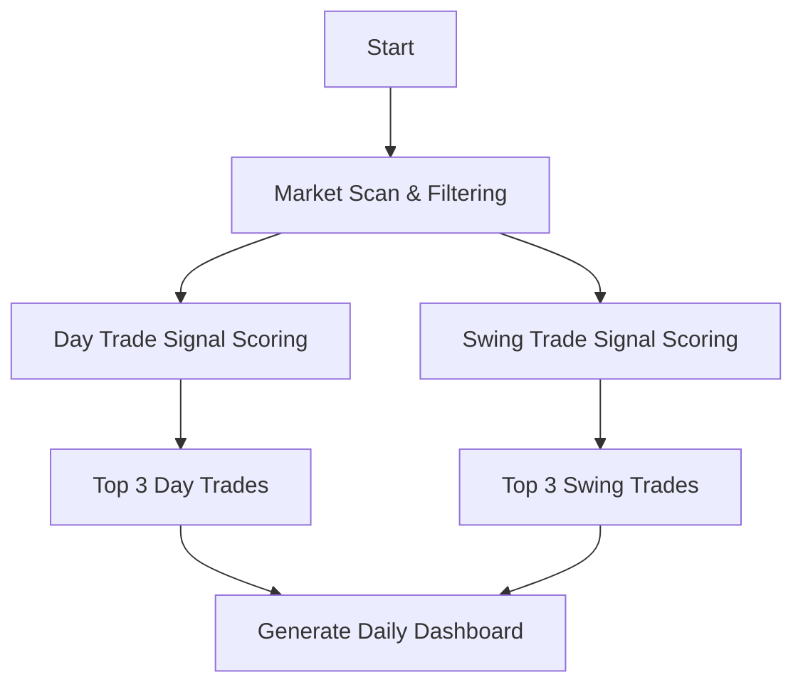

# 📊 Dual-Stream Trade Recommendations Engine

**Purpose:**  
Each trading day, output two curated Top 3 lists:
- 🕒 **Day Trades** – Short-term intraday setups for fast execution and exits
- 🕰️ **Swing Trades** – Multi-day to multi-week high-probability plays

Each trade idea includes entry logic, trade type (stock, options, crypto), strategy recommendation, risk/reward, and catalyst context.

---

## 🧠 Core Logic Flow

---

## 🕒 Top 3 – **Day Trades**

### Goals
- Quick setups with **high intraday probability**
- Focused on **RVOL, VWAP, gap-ups**, news catalysts
- Hold time: minutes to hours

### Filters & Signals
| Signal | Description |
|--------|-------------|
| 📈 Premarket Gappers | Stocks or tokens with >1–2% move in premarket |
| 🔁 VWAP Reclaims | Clean reclaims or rejections intraday |
| 🔥 RVOL > 1.5 | Strong intraday momentum |
| ⏱️ Time-of-day triggers | Opening range breakout, 10:30 reversal, etc. |
| ⚖️ ATR Zones | Target > 1R potential by 11:30am |
| 🧃 Liquidity Filters | Stock >$5, Avg vol >1M, Crypto with depth |
| 🚀 Options Flow | Unusual activity or short-dated IV spikes (optional) |

---

## 🕰️ Top 3 – **Swing Trades**

### Goals
- High-probability setups with **1–15 day hold**
- Focused on **trend continuation, breakouts, or reversals**
- Optional: Options strategy (debit spread, naked, LEAPS, etc.)

### Filters & Signals
| Signal | Description |
|--------|-------------|
| 🔁 Multi-Timeframe Trend | 20/50/200 EMA aligned bullish/bearish |
| ⛳ Pullback Entry | Back to rising support, trendline, Fib zone |
| 🚨 Catalyst Window | Earnings (past or upcoming), news cycle |
| 🔥 Momentum Scans | Relative strength vs sector/index (RSI, % above VWAP) |
| 🧩 Macro/Cycle Fit | Fit with seasonality, sector rotation, VIX trend |

---

## 📤 Example Output (Markdown Format)

### 🕒 Top 3 Day Trades – October 25, 2025

**1. LONG $NVDA (Stock)**  
- **Setup**: VWAP reclaim + High RVOL + Semiconductor sector lead  
- **Entry**: $417.20 (VWAP reclaim)  
- **Stop**: $414.80 (1R)  
- **Target**: $423.60  
- **Catalyst**: AI chip flow + TSLA earnings read-through  

---

### 🕰️ Top 3 Swing Trades – October 25, 2025

**1. SHORT $COIN (Options: Put Debit Spread)**  
- **Setup**: Bearish engulfing after failed breakout + Crypto weakness  
- **Entry**: Buy $70p, Sell $65p (Nov expiry)  
- **Cost**: $2.10, Max Value: $5.00  
- **Catalyst**: BTC funding rates flipped negative + SPY resistance  
- **Cycle Fit**: Week after major altcoin unlock (risk-off rotation)  

---

## 🔁 System Cycle

| Time | Action |
|------|--------|
| 4:30–5:30am PST | Pull data (price, volume, RVOL, VWAP, news, etc.) |
| 5:30am | Score and rank both day & swing signals |
| 6:00am | Output Top 3 of each to dashboard/feed |
| EOD | Log performance, missed trades, refine models |

---

## 🔮 Future Additions

- GPT-based narrative builder per idea  
- Backtest module (simulate daily runs on past 6–12 months)  
- Alerts feed (webhook or Telegram push)  
- “Bias override” flag (macro risk-on/off override)  
- Real-time market news integration (e.g., FinancialJuice, Benzinga)